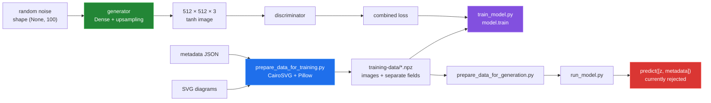

# GemDiagramAI


> Trains a conditional GAN on SVG gem-cutting diagrams and metadata, then generates new diagram images from metadata inputs.

This repository prepares SVG gem-cutting diagrams and metadata as tensors, then
builds a TensorFlow generator/discriminator training loop intended to produce
new diagrams. The current implementation is best understood as an experimental
GAN-shaped pipeline: the metadata is prepared and loaded, but the generator
actually accepts only a 100-value noise vector, so metadata-conditioned
generation is not working yet.


The image above is a contact sheet made from the repository's real prepared
training tensor. It shows the kind of diagram this project processes; it is not
claimed as output from a trained checkpoint.

## Why

Gem-cutting diagram generation is a niche problem with no off-the-shelf dataset or model. GemDiagramAI provides the full ML pipeline — data preparation, cGAN training on 512x512 images, and inference — so the workflow can be iterated on with real lapidary diagram data. `requirements.txt` targets Apple Silicon (`tensorflow-macos` and `tensorflow-metal`); on Linux, install it as shown below.

## Quick start

```bash
python3 -m venv venv
. venv/bin/activate

# On macOS (Apple Silicon):
pip install -r requirements.txt
# On Linux, requirements.txt fails as-is (see docs/BUGS-FOUND.md, entry 6):
grep -vE '^tensorflow-(macos|metal)$' requirements.txt > /tmp/req.txt
pip install -r /tmp/req.txt 'numpy<2'

# 1. Prepare training data from SVG images + JSON metadata
python prepare_data_for_training.py
# Reads SVGs and a JSON metadata file; writes .npz files to training-data/

# 2. Train the model
python train_model.py
# Meant to save generator checkpoints every 20 epochs and a final
# generator_model_final.h5. It currently runs out of memory in the first
# epoch (docs/BUGS-FOUND.md, entry 7).

# 3. Prepare generation inputs
python prepare_data_for_generation.py --save_dir generation-data

# 4. Generate new diagrams
python run_model.py --generation_data_dir generation-data
# Prompts for the path to a trained generator model (e.g. generator_model_final.h5)
```

Steps 2 to 4 do not work end to end yet; see [Known limitations](#known-limitations).

### Linux container run

Everything in [How this was measured](docs/measurement.md) runs in a
`python:3.11-slim-bookworm` container, with the repository mounted read-only:

```sh
sh tools/linux-run.sh training-data > media/captures/linux-run.txt
```

It prepares the three fixture SVGs in `tools/fixtures/`, measures the model and
the prepared dataset, runs the training and inference checks, and re-renders
the images in `media/`. The output of the last run is
[`media/captures/linux-run.txt`](media/captures/linux-run.txt).

## How it works

- `model.py` — defines the GAN architecture. Metadata is not yet a generator input. The generator upsamples a 100-dimensional noise vector through two `UpSampling2D + Conv2D` blocks to produce 512x512 RGB images. The discriminator is a four-layer strided-convolution network with LeakyReLU and dropout. Both use Adam (lr=0.0002, beta=0.5).
- `train_model.py` — orchestrates the adversarial training loop for 2000 epochs (configurable in `constants.py`), saving generator checkpoints every 20 epochs.
- `data_utils.py` — preprocessing utilities for loading and normalizing SVG-derived image data.
- `prepare_data_for_training.py` / `prepare_data_for_generation.py` — convert raw SVGs + metadata JSON into `.npz` arrays consumed by the training and inference scripts.
- `run_model.py` — loads a saved generator and calls it with noise plus metadata, a call the one-input generator currently rejects.
- `constants.py` — central config: `IMAGE_SIZE=512`, `EPOCHS=2000`, `BATCH_SIZE=32`, `SAVE_INTERVAL=20`.
- Training logs to TensorBoard (`./logs/`), with weight histograms on every step.

## Architecture and data flow



## What each script does today

| Script | Inputs | Output | Today |
|---|---|---|---|
| `prepare_data_for_training.py` | SVG directory + metadata JSON | image and metadata NPZ files | Works; the fixtures prepare cleanly. |
| `train_model.py` | prepared training directory | periodic and final generator H5 files | Models build; the first epoch runs out of memory in the TensorBoard callback. |
| `prepare_data_for_generation.py` | two interactive numeric values | normalized generation NPZ | Stops on hard-coded missing stats in a clean directory. |
| `run_model.py` | generator H5 + generation NPZ files | displayed generated image | The generator rejects the two-input prediction call. |

The project accepts SVG text and JSON metadata mappings. Text metadata is kept
as text; numeric arrays are standardized. It cannot currently handle a
metadata-conditioned generator call, or a clean generation directory without
the hard-coded stats files. Constant numeric columns normalize to zeros. Details and reproductions are in [Data preparation](docs/data-preparation.md),
[Inference](docs/inference.md), and [Bugs found](docs/BUGS-FOUND.md).

## Parameter surface

The configuration measurement printed the values below. The image shows the
same real SVG rendered at three `IMAGE_SIZE` values; this is the parameter
surface the current code actually supports, not a fabricated metadata sweep.


| Parameter | Value | Effect |
|---|---:|---|
| `IMAGE_SIZE` | 512 | Resizes each input into a square and sets generator output dimensions. |
| `EPOCHS` | 2000 | Number of iterations requested by the training script. |
| `BATCH_SIZE` | 32 | Number of samples used per update. |
| `SAVE_INTERVAL` | 20 | Checkpoint modulus; epoch zero is also saved. |
| `z_dim` | 100 | Width of the generator's only input noise vector. |

## Configuration

Edit `constants.py` to change image resolution, epoch count, batch size, or checkpoint frequency. All paths default to `training-data/` and `generation-data/` but can be overridden with CLI arguments.

## Results

From the Linux container run in [How this was measured](docs/measurement.md):

| Quantity | Result |
|---|---:|
| Prepared diagrams | 4,992 |
| Prepared image tensor | `(4992, 512, 512, 3)` float32 |
| Expanded image tensor | 15,703,474,304 bytes (14.63 GiB) |
| Stored metadata fields | 13, with 3 numeric fields |
| Generator parameters | 212,036,227 |
| Discriminator parameters | 1,471,809 |
| Combined-model parameters | 213,508,036 |
| Unconditioned generator output | `(1, 512, 512, 3)` |
| One training epoch, batch of 1 | Out of memory after 6 s; no checkpoint |

## Repository layout

| Path | Role |
|---|---|
| `data_utils.py` | SVG rasterization, resize, tensor scaling, and metadata normalization. |
| `model.py` | Generator, discriminator, combined model, and training loop. |
| `prepare_data_for_training.py` | Interactive SVG/JSON to NPZ preparation. |
| `prepare_data_for_generation.py` | Interactive generation metadata preparation. |
| `train_model.py` | Loads NPZ data and saves generator checkpoints. |
| `run_model.py` | Loads a generator and attempts to display one prediction. |
| `docs/` | Subsystem write-ups, measurements, and bug reproductions. |
| `tools/` | Measurement and media-rendering scripts plus small fixtures. |
| `media/` | Generated contact sheets and preprocessing diagrams. |

## Known limitations

- Metadata is not connected to the generator. `train_model.py` loads it, but the
  generator's signature is only `(None, 100)`.
- `run_model.py` passes noise and metadata as two inputs, so Keras rejects the
  call before an image is displayed.
- `prepare_data_for_generation.py` ignores `--save_dir`, uses hard-coded stats
  filenames, and writes NPZ keys that do not match the downstream loader.
- `requirements.txt` does not install on Linux: `tensorflow-macos` has no Linux
  wheel, and the unpinned `numpy` resolves to numpy 2, which TensorFlow 2.14
  cannot import. Install with `numpy<2` as in the quick start.
- Training runs out of memory in the first epoch. `histogram_freq=1` on the
  TensorBoard callback makes it histogram the 209,715,200-value first `Dense`
  kernel, which needs about 50 GB.
- The full prepared image tensor expands to 14.63 GiB in memory.
- No trained checkpoint or model-quality metric is committed. The images in
  `media/` are real source/training diagrams and preprocessing outputs.

The commands, outputs and fix status for each of these are in
[the bug register](docs/BUGS-FOUND.md) and [the measurement page](docs/measurement.md).

## Status

Experimental. The model architecture and training pipeline are implemented, but results depend on the quality and quantity of SVG training data supplied by the user. No pre-trained weights are included in the repository.

## License

MIT
