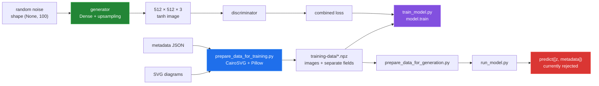

# Gem-Cutting Diagram Generator

This repository prepares SVG gem-cutting diagrams and metadata as tensors, then
builds a TensorFlow generator/discriminator training loop intended to produce
new diagrams. The current implementation is best understood as an experimental
GAN-shaped pipeline: the metadata is prepared and loaded, but the generator
actually accepts only a 100-value noise vector, so metadata-conditioned
generation is not working yet.


The image above is a contact sheet made from the repository's real prepared
training tensor. It shows the kind of diagram this project processes; it is not
claimed as output from a trained checkpoint.

## Quick start

The following commands were run successfully with the repository's existing
`tf_m1_env` environment (Python 3.11.5, TensorFlow 2.14.0, Pillow 10.0.1, and
CairoSVG 2.7.1):

```sh
prepared_dir=$(mktemp -d /tmp/gemdiagram-quickstart.XXXXXX)
printf '%s\n%s\n' "$PWD/tools/fixtures/svg" "$PWD/tools/fixtures/metadata.json" |
  tf_m1_env/bin/python prepare_data_for_training.py --save_dir "$prepared_dir"
tf_m1_env/bin/python tools/measure_dataset.py --data-dir "$prepared_dir"
tf_m1_env/bin/python tools/render_preprocessing.py
```

The preparation command reads the three fixture SVGs and writes one image NPZ
plus one NPZ per metadata field. `render_preprocessing.py` writes
`media/preprocessing-stages.png`. To render the existing full prepared dataset
into the committed contact sheets, run:

```sh
tf_m1_env/bin/python tools/render_samples.py
tf_m1_env/bin/python tools/render_parameter_grid.py
```

The dependency-install setup in the original README is source-derived and was
not reinstalled during this pass. A full training run and end-to-end inference
are not presented as working; see [Known limitations](#known-limitations).

## Architecture and data flow



## Capability comparison

| Path | Inputs | Intended output | Verified status |
|---|---|---|---|
| `prepare_data_for_training.py` | SVG directory + metadata JSON | image and metadata NPZ files | Works with the included fixtures. |
| `train_model.py` | prepared training directory | periodic and final generator H5 files | Model builds; full training duration not measured. |
| `prepare_data_for_generation.py` | two interactive numeric values | normalized generation NPZ | Stops on hard-coded missing stats in a clean directory. |
| `run_model.py` | generator H5 + generation NPZ files | displayed generated image | Current generator rejects the two-input prediction call. |

The project accepts SVG text and JSON metadata mappings. Text metadata is kept
as text; numeric arrays are standardized. It cannot currently handle a
metadata-conditioned generator call, zero-variance numeric columns without
producing `NaN`, or a clean generation directory without the hard-coded stats
files. Details and reproductions are in [Data preparation](docs/data-preparation.md),
[Inference](docs/inference.md), and [Bugs found](docs/BUGS-FOUND.md).

## Parameter surface

The configuration measurement printed the values below. The image shows the
same real SVG rendered at three `IMAGE_SIZE` values; this is the parameter
surface the current code actually supports, not a fabricated metadata sweep.


| Parameter | Value | Effect |
|---|---:|---|
| `IMAGE_SIZE` | 512 | Resizes each input into a square and sets generator output dimensions. |
| `EPOCHS` | 2000 | Number of iterations requested by the training script. |
| `BATCH_SIZE` | 32 | Number of samples used per update. |
| `SAVE_INTERVAL` | 20 | Checkpoint modulus; epoch zero is also saved. |
| `z_dim` | 100 | Width of the generator's only input noise vector. |

## Measured results

All values below come from the commands listed in
[How this was measured](docs/measurement.md):

| Measurement | Result |
|---|---:|
| Prepared diagrams | 4,992 |
| Prepared image tensor | `(4992, 512, 512, 3)` float32 |
| Expanded image tensor | 15,703,474,304 bytes (14.63 GiB) |
| Stored metadata fields | 13, with 3 numeric fields |
| Generator parameters | 212,036,227 |
| Discriminator parameters | 1,471,809 |
| Combined-model parameters | 213,508,036 |
| Unconditioned generator output | `(1, 512, 512, 3)` |

The one-epoch training probe wrote an **848,180,464-byte** checkpoint, but its
elapsed-time output did not return cleanly, so no training-speed claim is made.

## Repository layout

| Path | Role |
|---|---|
| `data_utils.py` | SVG rasterization, resize, tensor scaling, and metadata normalization. |
| `model.py` | Generator, discriminator, combined model, and training loop. |
| `prepare_data_for_training.py` | Interactive SVG/JSON to NPZ preparation. |
| `prepare_data_for_generation.py` | Interactive generation metadata preparation. |
| `train_model.py` | Loads NPZ data and saves generator checkpoints. |
| `run_model.py` | Loads a generator and attempts to display one prediction. |
| `docs/` | Subsystem write-ups, measurements, and bug reproductions. |
| `tools/` | Measurement and media-rendering scripts plus small fixtures. |
| `media/` | Generated contact sheets and preprocessing diagrams. |

## Known limitations

- Metadata is not connected to the generator. `train_model.py` loads it, but the
  generator's measured signature is only `(None, 100)`.
- `run_model.py` passes noise and metadata as two inputs, so Keras rejects the
  call before an image is displayed.
- `prepare_data_for_generation.py` ignores `--save_dir`, uses hard-coded stats
  filenames, and writes NPZ keys that do not match the downstream loader.
- Constant numeric metadata columns divide by zero during standardization and
  become `NaN`.
- The discriminator is compiled before being marked non-trainable; direct
  discriminator fitting still changes its weights after combination.
- `run_model.py` imports Matplotlib, but `requirements.txt` does not declare it.
- The full prepared image tensor expands to 14.63 GiB, and the measured
  generator has 212,036,227 parameters. A complete training run was not timed.
- No trained checkpoint or model-quality metric is committed. The images in
  `media/` are real source/training diagrams and preprocessing outputs.

For the exact commands, observed outputs, and proposed-but-not-applied fixes,
see [the documentation index](docs/README.md), [the measurement ledger](docs/measurement.md),
and [the bug register](docs/BUGS-FOUND.md).
