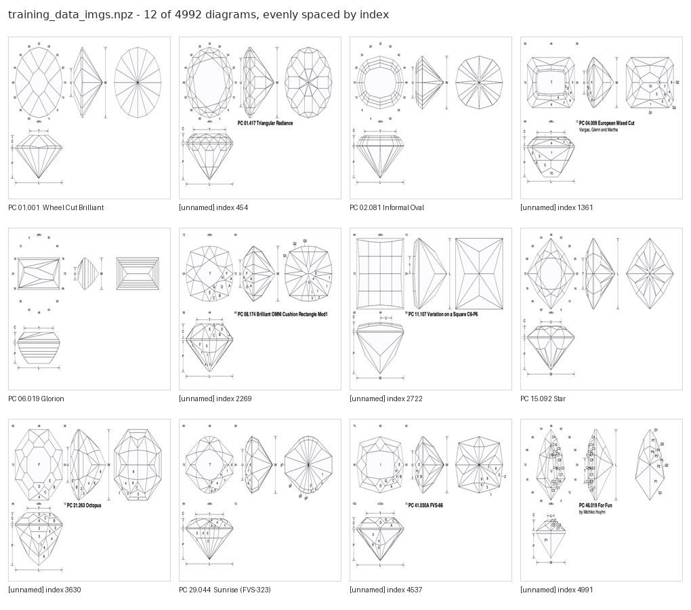
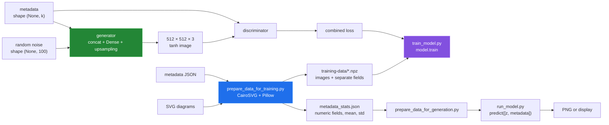
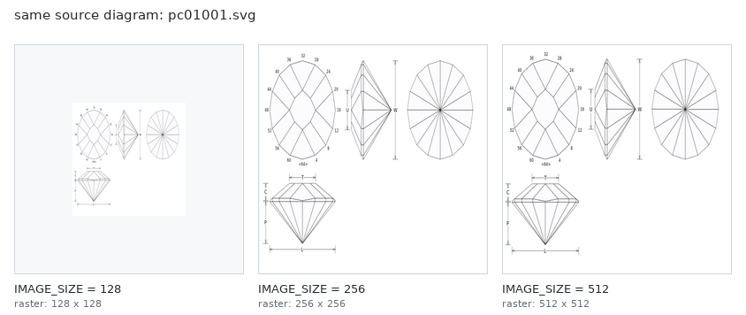

# GemDiagramAI


> Trains a conditional GAN on SVG gem-cutting diagrams and metadata, then generates new diagram images from metadata inputs.

This repository prepares SVG gem-cutting diagrams and metadata as tensors, then
builds a TensorFlow generator/discriminator training loop intended to produce
new diagrams. The generator and discriminator are conditioned on the numeric
metadata fields: the generator takes a 100-value noise vector plus the
normalized metadata, and the discriminator judges each image against the
metadata it should match. The pipeline runs end to end, but no trained
checkpoint or quality measurement exists yet.



The image above is a contact sheet made from the repository's real prepared
training tensor. It shows the kind of diagram this project processes; it is not
claimed as output from a trained checkpoint.

## Why

Gem-cutting diagram generation is a niche problem with no off-the-shelf dataset or model. GemDiagramAI provides the full ML pipeline — data preparation, cGAN training on 512x512 images, and inference — so the workflow can be iterated on with real lapidary diagram data. `requirements.txt` installs as-is on Linux and on macOS; the Apple Silicon packages (`tensorflow-macos`, `tensorflow-metal`) are only installed on macOS.

## Quick start

```bash
python3 -m venv venv
. venv/bin/activate

pip install -r requirements.txt

# 1. Prepare training data from SVG images + JSON metadata
python prepare_data_for_training.py
# Reads SVGs and a JSON metadata file; writes .npz files and
# metadata_stats.json (the numeric fields and their statistics) to training-data/

# 2. Train the model
python train_model.py
# Conditions on the fields in metadata_stats.json. Saves generator checkpoints
# every 20 epochs and a final generator_model_final.h5 in the working directory.
# --epochs, --batch_size and --save_interval override constants.py.

# 3. Prepare generation inputs
python prepare_data_for_generation.py --save_dir generation-data
# Prompts once per numeric field (blank = training mean); writes
# generation-data/generation_metadata.npz

# 4. Generate new diagrams
python run_model.py --generation_data_dir generation-data \
    --model generator_model_final.h5 --output diagram.png
# Without --model it prompts for the path; without --output it displays the image.
```

### Tests

```sh
sh tests/docker.sh
```

This installs `requirements.txt` unmodified in a `python:3.11-slim-bookworm`
container and runs the pytest suite in `tests/`. The suite uses 16 × 16
models and synthetic data and takes about 12 s after installation. It includes
an end-to-end run from the fixture SVGs to a generated PNG.

### Linux container run

Everything in [How this was measured](docs/measurement.md) runs in a
`python:3.11-slim-bookworm` container, with the repository mounted read-only:

```sh
sh tools/linux-run.sh training-data > media/captures/linux-run.txt
```

It installs `requirements.txt`, runs the tests, prepares the three fixture SVGs
in `tools/fixtures/`, measures the model and the prepared dataset, runs the
training and inference checks, and re-renders
the images in `media/`. The output of the last run is
[`media/captures/linux-run.txt`](media/captures/linux-run.txt).

## How it works

- `model.py` — defines the conditional GAN. The generator concatenates a 100-dimensional noise vector with the metadata vector and upsamples it through two `UpSampling2D + Conv2D` blocks to produce 512x512 RGB images. The discriminator is a four-layer strided-convolution network with LeakyReLU and dropout; the metadata joins its flattened features before the output layer. Both use Adam (lr=0.0002, beta=0.5).
- `train_model.py` — orchestrates the adversarial training loop for 2000 epochs (configurable in `constants.py` or on the command line), saving generator checkpoints every 20 epochs.
- `data_utils.py` — preprocessing utilities for loading SVG-derived image data and splitting, parsing and normalizing the metadata fields.
- `prepare_data_for_training.py` / `prepare_data_for_generation.py` — convert raw SVGs + metadata JSON into `.npz` arrays and `metadata_stats.json`, and turn metadata values typed at generation time into the normalized vector the generator expects.
- `run_model.py` — loads a saved generator, calls it with noise plus the generation metadata, and displays or saves the image.
- `constants.py` — central config: `IMAGE_SIZE=512`, `EPOCHS=2000`, `BATCH_SIZE=32`, `SAVE_INTERVAL=20`.
- Training logs losses and the graph to TensorBoard (`./logs/`). Weight histograms are off; the generator's first `Dense` kernel is too large for them.

## Architecture and data flow



## What each script does today

| Script | Inputs | Output | Today |
|---|---|---|---|
| `prepare_data_for_training.py` | SVG directory + metadata JSON | image and metadata NPZ files, `metadata_stats.json` | Works; the fixtures prepare cleanly with 8 numeric fields. |
| `train_model.py` | prepared training directory | periodic and final generator H5 files | Works; one full-size epoch with a batch of 1 takes about 5 s in the container. |
| `prepare_data_for_generation.py` | one value per numeric field + `metadata_stats.json` | `generation_metadata.npz` in `--save_dir` | Works from a clean directory. |
| `run_model.py` | generator H5 + `generation_metadata.npz` | displayed or saved image | Works; the tests generate a PNG from a freshly trained tiny model. |

The project accepts SVG text and JSON metadata mappings. A field whose
non-blank values are all numbers is standardized, with blanks set to the field
mean. Other fields are kept as text and not used for conditioning. Constant
numeric columns normalize to zeros. Details and reproductions are in [Data preparation](docs/data-preparation.md)
and [Inference](docs/inference.md).

## Parameter surface

The configuration measurement printed the values below. The image shows the
same real SVG rendered at three `IMAGE_SIZE` values; this is the parameter
surface the current code actually supports, not a fabricated metadata sweep.



| Parameter | Value | Effect |
|---|---:|---|
| `IMAGE_SIZE` | 512 | Resizes each input into a square and sets generator output dimensions. |
| `EPOCHS` | 2000 | Number of iterations requested by the training script. |
| `BATCH_SIZE` | 32 | Number of samples used per update. |
| `SAVE_INTERVAL` | 20 | Checkpoint modulus; epoch zero is also saved. |
| `z_dim` | 100 | Width of the generator's noise input. |
| metadata width | 8 | Numeric fields in `metadata_stats.json`: 8 for the fixtures and for a dataset prepared with this code. |

## Configuration

Edit `constants.py` to change image resolution, epoch count, batch size, or checkpoint frequency. All paths default to `training-data/` and `generation-data/` but can be overridden with CLI arguments.

## Results

From the Linux container run in [How this was measured](docs/measurement.md):

| Quantity | Result |
|---|---:|
| Prepared diagrams | 4,992 |
| Prepared image tensor | `(4992, 512, 512, 3)` float32 |
| Expanded image tensor | 15,703,474,304 bytes (14.63 GiB) |
| Stored metadata fields | 13; 3 numeric in the prepared copy, which predates the blank-field fix; 8 numeric in the fixtures |
| Generator parameters (8 metadata fields) | 228,813,443 |
| Discriminator parameters | 1,471,817 |
| Combined-model parameters | 230,285,260 |
| Conditioned generator output | `(1, 512, 512, 3)` |
| One training epoch, batch of 1 | 5.06 s; 872.9 MiB checkpoint |
| Test suite | 23 passed |

## Repository layout

| Path | Role |
|---|---|
| `data_utils.py` | SVG rasterization, resize, tensor scaling, and metadata normalization. |
| `model.py` | Generator, discriminator, combined model, and training loop. |
| `prepare_data_for_training.py` | Interactive SVG/JSON to NPZ preparation. |
| `prepare_data_for_generation.py` | Interactive generation metadata preparation. |
| `train_model.py` | Loads NPZ data and saves generator checkpoints. |
| `run_model.py` | Loads a generator and displays or saves one prediction. |
| `tests/` | pytest suite and `docker.sh`, which runs it in Linux. |
| `docs/` | Subsystem write-ups, measurements, and bug reproductions. |
| `tools/` | Measurement and media-rendering scripts plus small fixtures. |
| `media/` | Generated contact sheets and preprocessing diagrams. |

## Known limitations

- Data prepared before `metadata_stats.json` existed must be prepared again;
  `train_model.py` and `prepare_data_for_generation.py` stop and say so.
- Checkpoints from before conditioning take noise only. `run_model.py` still
  loads them and generates from noise, with a warning.
- The full prepared image tensor expands to 14.63 GiB in memory, and
  `train_model.py` loads all of it.
- No trained checkpoint or model-quality metric is committed. The images in
  `media/` are real source/training diagrams and preprocessing outputs.

Bugs are tracked as [GitHub issues](https://github.com/Bissbert/GemDiagramAI/issues), and each fix has a
regression test in [`tests/`](tests). Measurements are on
[the measurement page](docs/measurement.md).

## Status

Experimental. The model architecture and training pipeline are implemented, but results depend on the quality and quantity of SVG training data supplied by the user. No pre-trained weights are included in the repository.

## License

MIT
