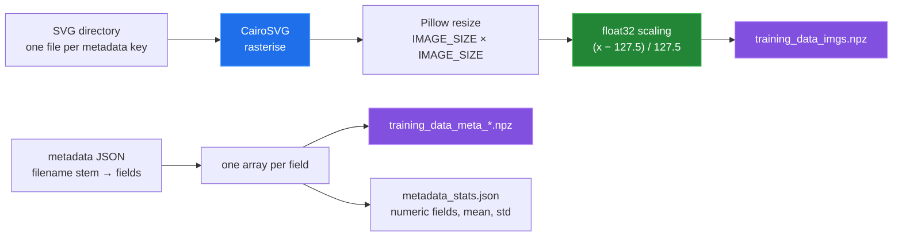
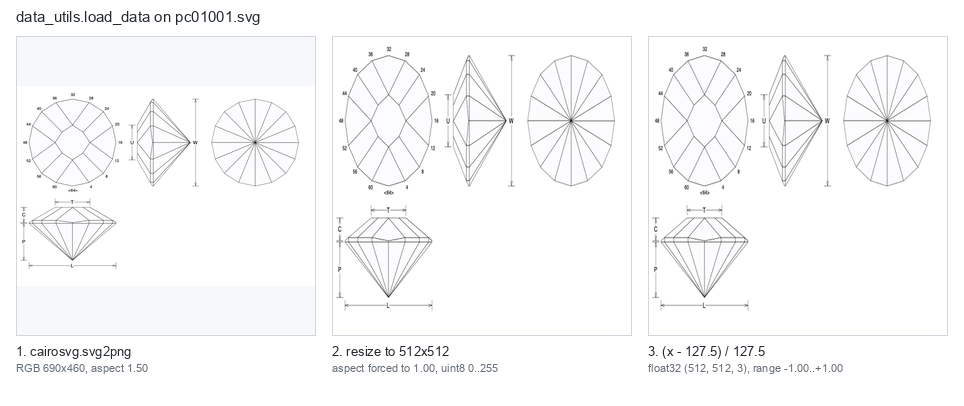

# Data preparation

[← back to the overview](../README.md)

The preparation script accepts a directory of SVG files and a JSON object whose
keys are SVG filename stems. It reads the SVGs as text, rasterises them with
CairoSVG, resizes every image to the configured square, and stores the result
as float32 values in the `[-1, 1]` range.



The metadata path is intentionally simple:

| Input | Behaviour |
|---|---|
| SVG text | Read from `<stem>.svg`; SVGs with a usable CairoSVG rendering are accepted. |
| JSON object | Iterated in JSON order; each value must be a metadata mapping. |
| Numeric field | Every non-blank value is a number (numeric strings count). Parsed as float and standardized independently by its mean and standard deviation. |
| Blank in a numeric field | A missing key, `null` or `""`. Set to the field mean, so it becomes 0 after standardizing. |
| Text field | Anything else. Kept as text (blanks as `""`), not standardized, and not used for conditioning. |

A numeric field whose values are all equal normalizes to zeros.

`metadata_stats.json` lists the numeric fields in JSON order, with the mean
and standard deviation used for each one. `train_model.py` conditions the model
on those fields in that order. `prepare_data_for_generation.py` uses the same
statistics to normalize new values.

The repository includes three fixture SVGs and matching metadata. This run is
part of the Linux container run in [How this was measured](measurement.md):

```sh
mkdir /tmp/fx
printf '%s\n%s\n' "$PWD/tools/fixtures/svg" "$PWD/tools/fixtures/metadata.json" |
  python3 -W error::RuntimeWarning prepare_data_for_training.py --save_dir /tmp/fx
python3 tools/measure_dataset.py --data-dir /tmp/fx
```

The command produced **3** image rows, **13** metadata fields (8 of them
numeric) and `metadata_stats.json`. The prepared image tensor was `(3, 512, 512, 3)` with dtype `float32`.
All three fixtures share one `lengthWidthRatio`, so that column is all zeros;
with runtime warnings promoted to errors the preparation still exits 0. Before
[`08be6ff`](https://github.com/Bissbert/GemDiagramAI/commit/08be6ff) this column
became `NaN` (entry 1 in [the bug register](BUGS-FOUND.md)).

## What the full prepared dataset contains

The same measurement against the git-ignored `training-data/` directory
reported **4,992** rows and the following field
split:

| Stored field kind | Count | Current behaviour |
|---|---:|---|
| Numeric fields | 3 | Standardized; `faceCount`, `lengthWidthRatio`, and `volumeWidthCubedRatio`. |
| Text fields | 10 | Preserved as strings. |
| Image shape | `(4992, 512, 512, 3)` | Float32 tensor, scaled to `[-1, 1]`. |

That copy was prepared before the fix for entry 8 in
[the bug register](BUGS-FOUND.md). Five of its text fields hold only numbers
and blanks: `tableWidthRatio` and `culetWidthRatio` (497 blanks each),
`pavilionWidthRatio` (170), `crownWidthRatio` (159) and `girdles` (39).
Preparing the source SVGs again gives 8 numeric fields and writes the
`metadata_stats.json` that training needs.

The prepared array is large when expanded: the measurement reported
**15,703,474,304 bytes** in memory (**14.63 GiB**) and **474,755,860 bytes** on
disk for the compressed image archive. The image contact sheet below is made
from that real prepared tensor, not from hand-drawn placeholders.


The source-to-tensor stages are also rendered from a real fixture run:



Known data caveats are collected in [Known limitations](../README.md#known-limitations)
and [Bugs found](BUGS-FOUND.md).
