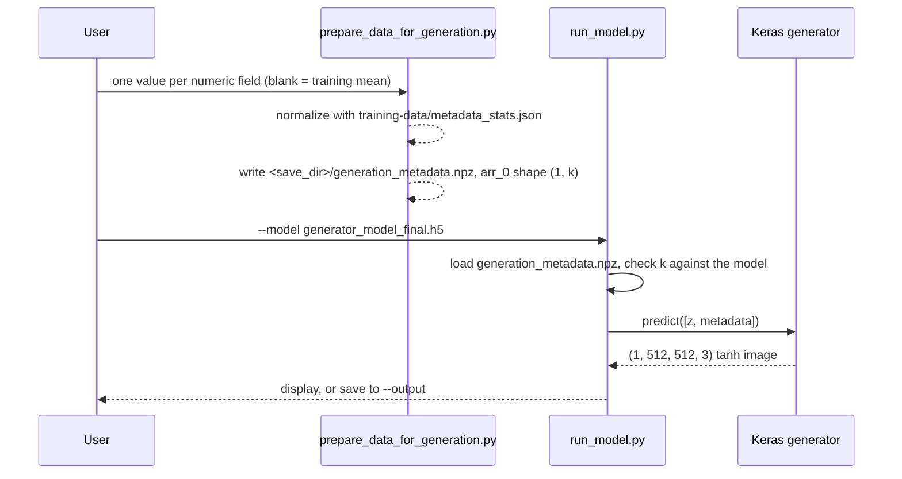

# Inference path

[← back to the overview](../README.md)

Inference has two steps. First, prepare the metadata for the diagram you want.
Then run a saved generator on it, which either displays the image or saves it
as a PNG.



The check runs in the Linux container from [How this was measured](measurement.md):

```sh
python3 tools/check_inference_path.py
```

With the conditioned generator, `predict([z, metadata])` returns a
`(1, 512, 512, 3)` tensor. `predict(z)` without metadata is rejected by Keras'
two-input check. Before the fix for entry 2 in [BUGS-FOUND.md](BUGS-FOUND.md),
the reverse was true. `matplotlib`, which `run_model.py` imports, is installed
from `requirements.txt` since
[`438f225`](https://github.com/Bissbert/GemDiagramAI/commit/438f225).

`prepare_data_for_generation.py` writes to `--save_dir` and reads the
statistics from `--training_data_dir` (entry 4 in [BUGS-FOUND.md](BUGS-FOUND.md)).
`tests/test_pipeline.py::test_end_to_end_conditioned_generation` runs the whole
path on a 16 × 16 model trained for one epoch on the fixtures, and checks that
the saved PNG is 16 × 16.

## Inputs the current path can and cannot handle

| Input | Current result |
|---|---|
| Conditioned generator `.h5` | Loaded with `load_model(..., compile=False)` and called with `[z, metadata]`. |
| Generator `.h5` from before conditioning | Loaded and called with noise only, with a warning. |
| `generation_metadata.npz` with the wrong number of fields | Stops with a message giving both widths. |
| A clean `--save_dir` that does not exist yet | Created. |
| A training directory without `metadata_stats.json` | Stops and asks for `prepare_data_for_training.py` to be run again. |
| No display | Use `--output diagram.png`. |
