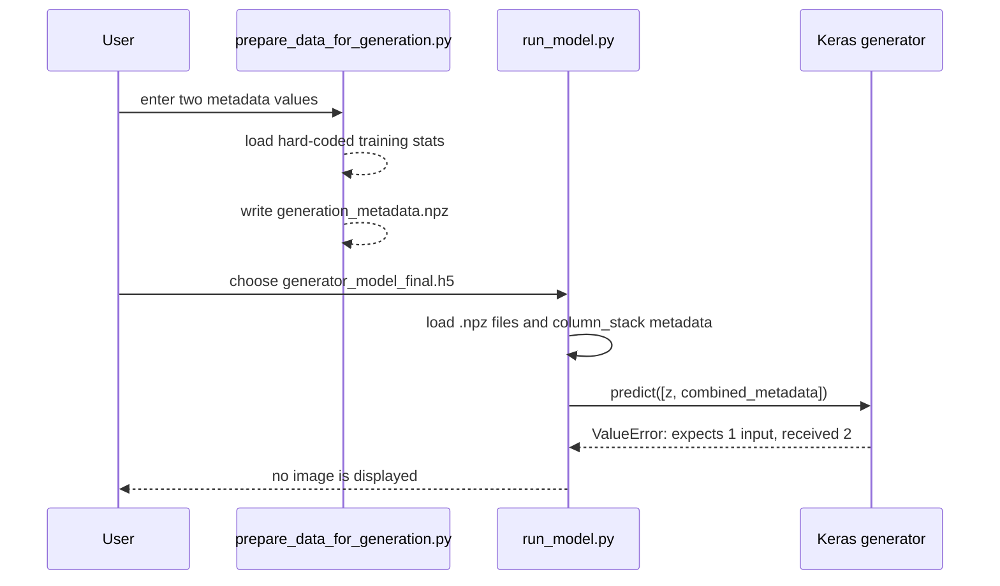

# Inference path

[← back to the overview](../README.md)

The intended inference path is interactive: prepare metadata, choose a saved
generator, load all `.npz` arrays in the generation directory, and display one
generated image. The implemented path stops at the prediction call because the
generator has one input but receives two.



The check runs in the Linux container from [How this was measured](measurement.md):

```sh
python3 tools/check_inference_path.py
```

`predict(z)` returns a `(1, 512, 512, 3)` tensor, and
`predict([z, combined_metadata])` fails with Keras' one-input error. That is
entry 2 in [BUGS-FOUND.md](BUGS-FOUND.md), still open. `matplotlib`, which
`run_model.py` imports, is installed from `requirements.txt` since
[`438f225`](https://github.com/Bissbert/GemDiagramAI/commit/438f225).

The generation-preparation script has a separate path and file-format problem:
`--save_dir` is parsed but not used, stats filenames are hard-coded, and the
written named keys do not match the `arr_0` key `run_model.py` reads. A
clean-directory reproduction is entry 4 in [BUGS-FOUND.md](BUGS-FOUND.md),
still open.

## Inputs the current path can and cannot handle

| Input | Current result |
|---|---|
| Existing generator `.h5` | Loaded through `tensorflow.keras.models.load_model`. |
| A 100-value noise vector | Accepted by the generator. |
| Metadata alongside the noise vector | Rejected by the generator's one-input signature. |
| A generation directory containing the expected `arr_0` arrays | Read and column-stacked, subject to the failing prediction call. |
| A clean generation directory | Preparation fails first because the hard-coded stats files are absent. |
