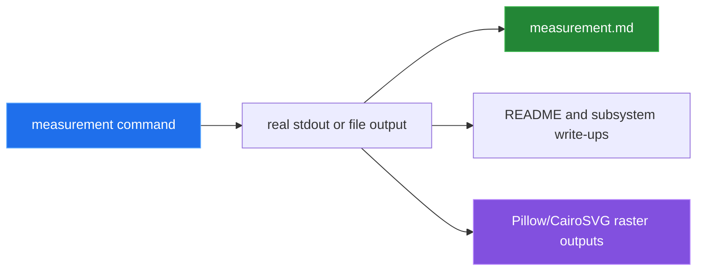

# How this was measured

[← back to the overview](../README.md)

Every number and committed raster image in this pass came from a command run in
the repository. The measurement scripts are in [`tools/`](../tools). They use
the project's existing Python environment for NumPy, TensorFlow, CairoSVG, and
Pillow; no new runtime dependency was added.

## Commands and provenance

| Command | What it measured or produced |
|---|---|
| `tf_m1_env/bin/python tools/measure_config.py` | Values in `constants.py`: image size, epoch count, batch size, save interval, and default directories. |
| `tf_m1_env/bin/python tools/measure_dataset.py` | NPZ headers, expanded tensor size, metadata dtypes, row counts, normalization summaries, and duplicate fields. It reads the image header without expanding the full image tensor. |
| `tf_m1_env/bin/python tools/measure_model.py` | Keras input/output signatures, layer shapes, total parameters, and trainable parameters before and after `build_combined`. |
| `tf_m1_env/bin/python tools/check_training_wiring.py --batch-size 1` | Actual weight deltas from discriminator and combined `fit` calls. |
| `tf_m1_env/bin/python tools/check_inference_path.py` | Actual generator prediction success/failure and the environment's plotting-dependency state. |
| `tf_m1_env/bin/python tools/render_samples.py` | Contact sheets decoded from the prepared `training-data/training_data_imgs.npz` tensor. |
| `tf_m1_env/bin/python tools/render_preprocessing.py` | Three stages from a real fixture SVG through CairoSVG, resize, and signed tensor display. |
| `tf_m1_env/bin/python tools/render_parameter_grid.py` | One fixture SVG at the real sizes `[128, 256, 512]`. |
| `tf_m1_env/bin/python tools/measure_training_step.py --epochs 1 --batch-size 1 --images random` | A real one-epoch training attempt and checkpoint output. Its elapsed-time report did not return cleanly, so duration is not quoted. |

## Dataset measurement

The full existing prepared archive reported **4,992** rows, shape
`(4992, 512, 512, 3)`, dtype `float32`, **474,755,860 bytes** on disk, and
**15,703,474,304 bytes** when expanded. The metadata directory contained
**13** fields, of which **3** were numeric in the stored arrays. The complete
field summaries are the output of `tools/measure_dataset.py`, not estimates.

The fixture preparation command was also run with three SVGs. It produced three
rows and 13 fields, and exposed the zero-variance normalization bug documented
in [BUGS-FOUND.md](BUGS-FOUND.md).

## Model and wiring measurement

The model probe reported **212,036,227** generator parameters,
**1,471,809** discriminator parameters, and **213,508,036** parameters in the
combined stack. The inference probe reported a generator input of
`[[None, 100]]` and a successful unconditioned output shape of
`(1, 512, 512, 3)`.

The training-wiring probe changed weights with a maximum absolute delta of
`1.894e-01` during direct discriminator fitting after the discriminator was
marked non-trainable, while `combined.fit` left the discriminator delta at
`0.000e+00` and changed generator weights by `2.000e-01`.

## Media provenance

`media/dataset-samples.png` and `media/dataset-by-girdles.png` are contact
sheets made by decoding the repository's existing prepared tensor. They show
real source diagrams, not output from a trained checkpoint.

`media/preprocessing-stages.png` was made from
`tools/fixtures/svg/pc01001.svg`. The command printed a native RGB size of
`(690, 460)`, a resized size of `(512, 512)`, and a final tensor range of
`-1.0000..+1.0000`.

`media/parameter-grid.png` was made from that same fixture at raster sizes 128,
256, and 512. It demonstrates the supported `IMAGE_SIZE` surface; it is not a
metadata-conditioning result.

## Not measured

- A complete 2,000-epoch run was not measured because the one-epoch timing
  capture did not return its elapsed-time report cleanly and the model is
  resource-heavy.
- A trained generator's diagram quality was not measured. The committed sample
  images are source/training diagrams, and no trained checkpoint is committed.
- End-to-end metadata-conditioned inference was not measured because the
  current one-input generator rejects the two-input call.
- No animation is shipped: this repository has no interactive terminal or
  server output to capture, and the real raster outputs were sufficient for the
  documentation pass.
