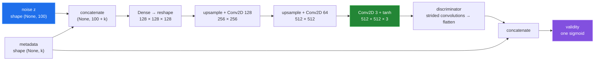

# Model architecture

[← back to the overview](../README.md)

`model.py` builds three Keras models: a generator, a discriminator, and a
generator-discriminator stack used for generator updates. It is a conditional
GAN: with `meta_dim` set, the generator takes the noise vector and a metadata
vector, and the discriminator takes an image and the metadata it should match.
`train_model.py` sets `meta_dim` to the number of numeric fields in
`metadata_stats.json`. With `meta_dim=0` the builders return the original
single-input models.



The architecture measurement was run with:

```sh
python3 tools/measure_model.py
```

in the Linux container from [How this was measured](measurement.md), with the
default `--meta-dim 8` (the numeric fields of the fixtures).

| Built object | Inputs | Output | Total parameters |
|---|---|---|---:|
| Generator | `(None, 100)`, `(None, 8)` | `(None, 512, 512, 3)` | 228,813,443 |
| Discriminator | `(None, 512, 512, 3)`, `(None, 8)` | `(None, 1)` | 1,471,817 |
| Combined stack | `(None, 100)`, `(None, 8)` | `(None, 1)` | 230,285,260 |

After `build_combined`, the measured discriminator trainable-parameter count
is **0** while the generator remains at **228,813,059** trainable parameters.
The discriminator still learns in its own `fit` calls, because it was compiled
while trainable. That is the intended GAN setup; see [Training](training.md).

Metadata became an input with the fix for entry 2 in
[BUGS-FOUND.md](BUGS-FOUND.md).

The model's largest layer is the generator's first dense layer. The measurement
reported **228,589,568** parameters for that layer alone. A kernel this size is
why training logs no TensorBoard weight histograms: with `histogram_freq=1`
the first epoch ran out of memory (entry 7 in [BUGS-FOUND.md](BUGS-FOUND.md)).

## Parameter surface

The real fixture grid varies the raster-size parameter while holding the source
SVG fixed. There is no metadata-controlled grid yet, because no trained
checkpoint exists to generate one from.


The configuration measurement printed these values:

| Parameter | Measured value | What it changes |
|---|---:|---|
| `IMAGE_SIZE` | 512 | Square raster dimensions and generator output dimensions. |
| `EPOCHS` | 2000 | Number of iterations requested by `train_model.py`. |
| `BATCH_SIZE` | 32 | Number of images and labels used per training update. |
| `SAVE_INTERVAL` | 20 | Epoch modulus used for generator checkpoints. |
| `z_dim` | 100 | Width of the generator's noise input. |
| `meta_dim` | 8 | Numeric metadata fields, read from `metadata_stats.json`. |

The `--save_dir`, `--training_data_dir`, and `--generation_data_dir` flags change
where scripts look or write. `train_model.py` also takes `--epochs`,
`--batch_size` and `--save_interval`.
