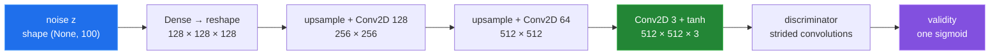

# Model architecture

[← back to the overview](../README.md)

`model.py` builds three Keras models: a generator, a discriminator, and a
generator-discriminator stack used for generator updates. Despite the original
README calling this a conditional GAN, the implemented generator accepts only
the noise vector. Metadata is loaded elsewhere but is not connected to this
graph.



The architecture measurement was run with:

```sh
tf_m1_env/bin/python tools/measure_model.py
```

| Built object | Input | Output | Total parameters |
|---|---|---|---:|
| Generator | `(None, 100)` | `(None, 512, 512, 3)` | 212,036,227 |
| Discriminator | `(None, 512, 512, 3)` | `(None, 1)` | 1,471,809 |
| Combined stack | `(None, 100)` | `(None, 1)` | 213,508,036 |

After `build_combined`, the measured discriminator trainable-parameter count
is **0** while the generator remains at **212,035,843** trainable parameters.
The separate discriminator `fit` path nevertheless changes weights because the
discriminator was compiled before its trainable flag was changed. That is a
runtime wiring bug, not a design claim; the reproduction is in
[BUGS-FOUND.md](BUGS-FOUND.md).

The model's largest layer is the generator's first dense layer. The measurement
reported **211,812,352** parameters for that layer alone. This is why a full
training run is resource-heavy even before the data tensor is expanded in
memory.

## Parameter surface

The real fixture grid varies the raster-size parameter while holding the source
SVG fixed. It is an honest visual comparison: there is no metadata-controlled
grid because metadata is not a generator input in the current implementation.


The configuration measurement printed these values:

| Parameter | Measured value | What it changes |
|---|---:|---|
| `IMAGE_SIZE` | 512 | Square raster dimensions and generator output dimensions. |
| `EPOCHS` | 2000 | Number of iterations requested by `train_model.py`. |
| `BATCH_SIZE` | 32 | Number of images and labels used per training update. |
| `SAVE_INTERVAL` | 20 | Epoch modulus used for generator checkpoints. |
| `z_dim` | 100 | Width of the generator's only input noise vector. |

The `--save_dir`, `--training_data_dir`, and `--generation_data_dir` flags change
where scripts look or write, subject to the generation-path bug documented in
[BUGS-FOUND.md](BUGS-FOUND.md).
