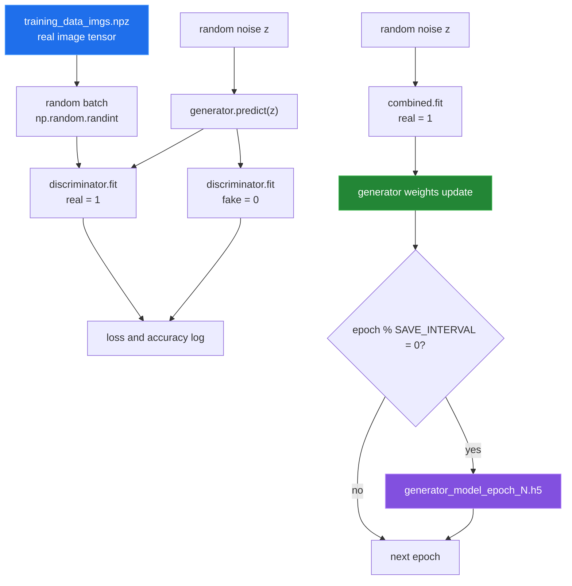

# Training loop

[← back to the overview](../README.md)

`train_model.py` loads the prepared image archive and every metadata archive,
constructs the three Keras models, and calls `model.train`. The metadata matrix
is passed into that function but the current loop does not read it.



The default configuration measurement reported **2,000** epochs, a batch size
of **32**, and a save interval of **20**. The loop saves at epoch zero because
the condition is checked after the first update and `0 % 20` is zero. It also
saves a final generator at the end of `train_model.py`.

## What was measured

The training-wiring probe was run with a one-example batch:

```sh
tf_m1_env/bin/python tools/check_training_wiring.py --batch-size 1
```

| Probe | Result |
|---|---|
| Control discriminator, never combined | `1,470,913` trainable parameters; weights changed. |
| Discriminator after `build_combined` | `0` reported trainable parameters; direct `fit` still changed weights with max delta `1.894e-01`. |
| `combined.fit` → discriminator | Frozen; max delta `0.000e+00`. |
| `combined.fit` → generator | Learned; max delta `2.000e-01`. |

The result means the two update paths do not share the same effective
trainability state. The implementation was left untouched; see
[BUGS-FOUND.md](BUGS-FOUND.md) for the proposed correction.

The one-epoch training probe did write a real checkpoint of **848,180,464
bytes**, but its elapsed-time report did not return cleanly in the tool
session. No training duration or projected full-run duration is published.
