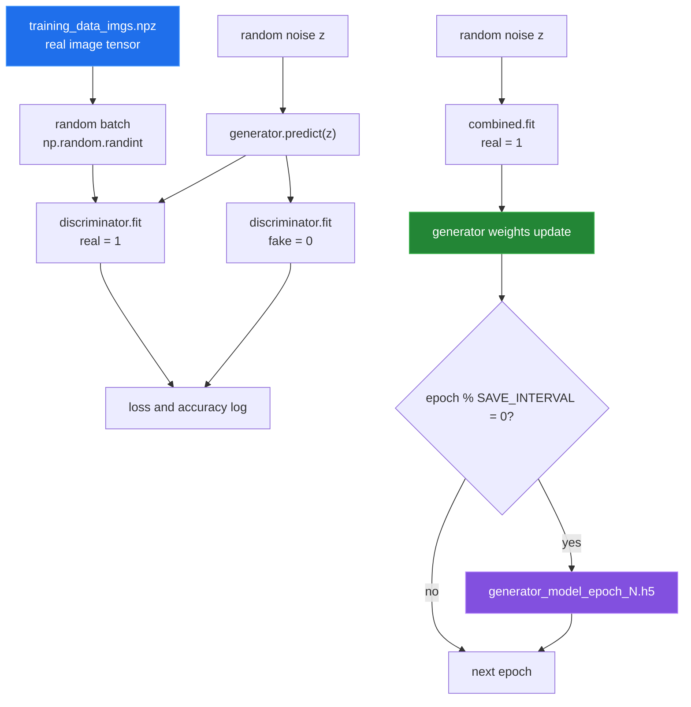

# Training loop

[← back to the overview](../README.md)

`train_model.py` loads the prepared image archive and every metadata archive,
constructs the three Keras models, and calls `model.train`. The metadata matrix
is passed into that function but the current loop does not read it.



The default configuration measurement reported **2,000** epochs, a batch size
of **32**, and a save interval of **20**. The loop saves at epoch zero because
the condition is checked after the first update and `0 % 20` is zero. It also
saves a final generator at the end of `train_model.py`.

Every `fit` call gets a `TensorBoard` callback with `histogram_freq=1`
(`model.py:110`). That setting currently stops training in the first epoch; see
[One epoch](#one-epoch) below.

## Training wiring

The discriminator is compiled while trainable, then `build_combined` marks it
non-trainable and compiles the combined model. Keras keeps the trainable state
each model had at compile time, so the discriminator learns in its own `fit`
calls and stays frozen when `combined.fit` updates the generator.

`tools/check_training_wiring.py` checks this with a one-example batch, in the
Linux container from [How this was measured](measurement.md):

```sh
python3 tools/check_training_wiring.py --batch-size 1
```

| Probe | Result |
|---|---|
| Control discriminator, never combined | `1,470,913` trainable parameters; weights changed. |
| Discriminator after `build_combined` | `0` reported trainable parameters; its own `fit` still learns, max delta `2.018e-01`. |
| `combined.fit` → discriminator | Frozen; max delta `0.000e+00`. |
| `combined.fit` → generator | Learned; max delta `2.000e-01`. |

Those are the two phases a GAN needs. This was once reported as a bug and
rejected; see entry 3 in [BUGS-FOUND.md](BUGS-FOUND.md).

## One epoch

```sh
python3 tools/measure_training_step.py --epochs 1 --batch-size 1 --images random
```

The run exits 1 after 6 seconds. Both discriminator steps finish, then the first
`combined.fit` fails in the TensorBoard histogram callback:

```
OOM when allocating tensor with shape[209715200,30] and type double ... [Op:OneHot]
```

209,715,200 is the size of the generator's first `Dense` kernel
(100 × 2,097,152). Bucketing it as a float64 one-hot needs about 50 GB; the
container had 33 GB. No checkpoint is written and no training time is
reported. This is entry 7 in [BUGS-FOUND.md](BUGS-FOUND.md).
