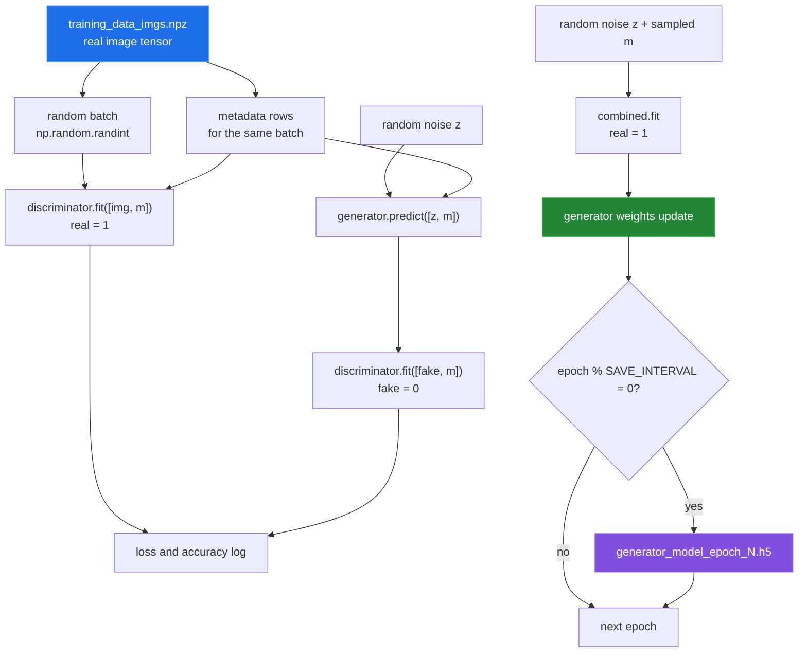

# Training loop

[← back to the overview](../README.md)

`train_model.py` loads the prepared image archive and the numeric metadata
fields listed in `metadata_stats.json`, in that order. It builds the three
conditioned Keras models, sizing them from the image tensor, and calls
`model.train`. Each epoch samples a batch of images together with their
metadata rows. The same rows go to the generator, to both discriminator steps
and to `combined.fit`.



The default configuration measurement reported **2,000** epochs, a batch size
of **32**, and a save interval of **20**. `--epochs`, `--batch_size` and
`--save_interval` override them. The loop saves at epoch zero because
the condition is checked after the first update and `0 % 20` is zero. It also
saves a final generator at the end of `train_model.py`.

Every `fit` call gets a `TensorBoard` callback that logs losses and the graph.
Weight histograms are off (`histogram_freq=0`), because with them the first
epoch ran out of memory; see [One epoch](#one-epoch) below.

## Training wiring

The discriminator is compiled while trainable, then `build_combined` marks it
non-trainable and compiles the combined model. Keras keeps the trainable state
each model had at compile time, so the discriminator learns in its own `fit`
calls and stays frozen when `combined.fit` updates the generator.

`tools/check_training_wiring.py` checks this on the conditioned models with a
one-example batch, in the Linux container from
[How this was measured](measurement.md):

```sh
python3 tools/check_training_wiring.py --batch-size 1
```

| Probe | Result |
|---|---|
| Control discriminator, never combined | `1,470,921` trainable parameters; weights changed. |
| Discriminator after `build_combined` | `0` reported trainable parameters; its own `fit` still learns, max delta `1.890e-01`. |
| `combined.fit` → discriminator | Frozen; max delta `0.000e+00`. |
| `combined.fit` → generator | Learned; max delta `2.000e-01`. |

Those are the two phases a GAN needs. This was once reported as a bug and
rejected; see entry 3 in [BUGS-FOUND.md](BUGS-FOUND.md).
`tests/test_model.py::test_discriminator_learns_and_combined_freezes_it` checks
the same thing on a 16 × 16 model.

## One epoch

```sh
python3 tools/measure_training_step.py --epochs 1 --batch-size 1 --images random
```

At full size (512 × 512, 8 metadata fields), on random images:

```
0 [D loss: 0.936586, acc.: 0.00%] [G loss: 0.920787]

total       : 5.06 s for 1 epochs
per epoch   : 5.06 s
projected   : 2.81 h for constants.EPOCHS = 2000
checkpoint  : generator_model_epoch_0.h5 915,291,768 bytes (872.9 MiB)
```

The projection is for a batch of 1; the default batch of 32 costs more per
epoch. Each checkpoint is 872.9 MiB, and with `SAVE_INTERVAL = 20` a full run
writes 100 of them.

Before the fix for entry 7 in [BUGS-FOUND.md](BUGS-FOUND.md), this command
exited 1 after 6 seconds. The TensorBoard histogram callback in the first
`combined.fit` failed with
`OOM when allocating tensor with shape[209715200,30] and type double`.
209,715,200 was the size of the generator's first `Dense` kernel
(100 × 2,097,152), and bucketing it as a float64 one-hot needs about 50 GB.
